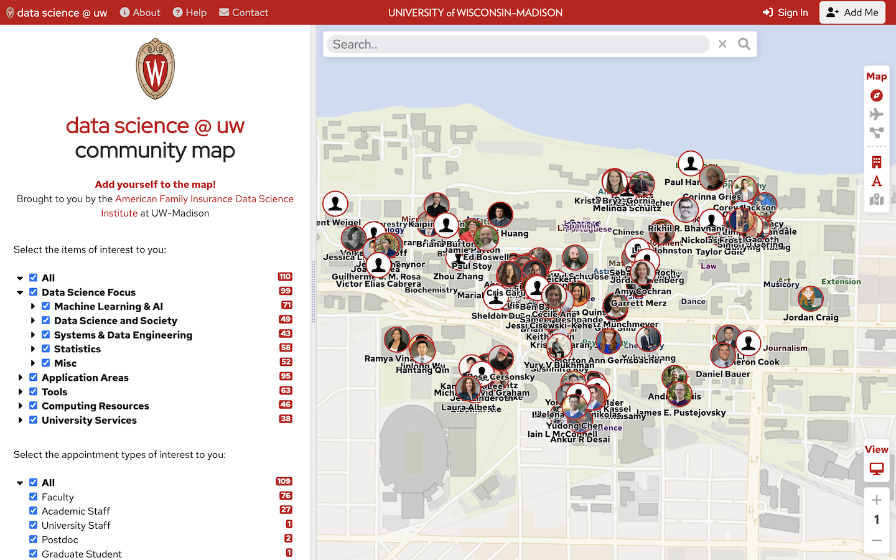

<p align="center">
  <div align="center">
    
  </div>
</p>

# Community Map

The Community Map is a an interactive web-based map that allows exploration of the community of faculty, staff, and students at the University of Wisconsin-Madison.  It allows for searching for people by name or by topic / area of expertise.



# Applications / Uses

The Community Map can be customized for your own needs and can be used for the following purposes:

- Connecting with other people with shared interests.
- Introducing yourself and your work to a community of like-minded people.
- Learning about activities and other people in your sphere of interest.
- Learning about the trends and interests of a community.

# Installation

## Docker Installation

A docker installation is provided to make getting started quick and easy.  To run the application using Docker, simply type:

```
docker compose up
```

## Manual Installation

If you would like more control over the installation process, you can follow a [manual installation process](INSTALL.MD).

## Architecture

The application involves the following main components:


- Client map application

Displays the map user interface and communicates with the back end servers.

- Academic info server

Provides information about the academic community at the UW Madison.

- Authentication info server

Provides the ability to create accounts, sign in, and manage user accounts.

- Campus map server

<!-- LICENSE -->
## License

Distributed under the MIT License. See `LICENSE` for more information.

<!-- TEAM -->
## Team
The datascience @ uw team includes:

Abe Megahed, Kyle Cranmer, Cris Carusi

<!-- CONTACT -->
## Contact

Abe Megahed - (mailto:amegahed@wisc.edu) - email

Project Link: [https://github.com/AFIDSI/datascience-map](https://github.com/AFIDSI/datascience-map)
