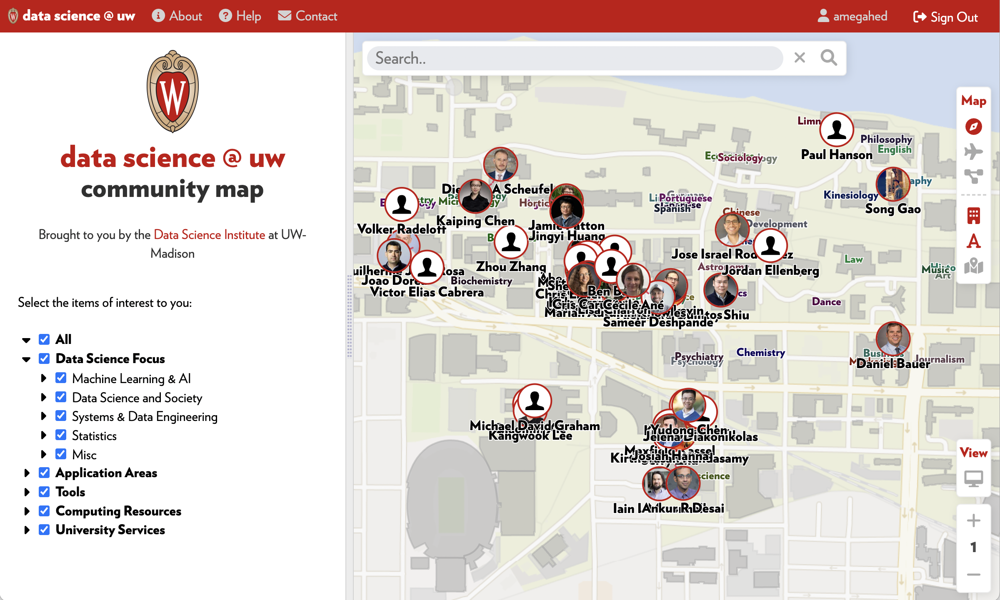
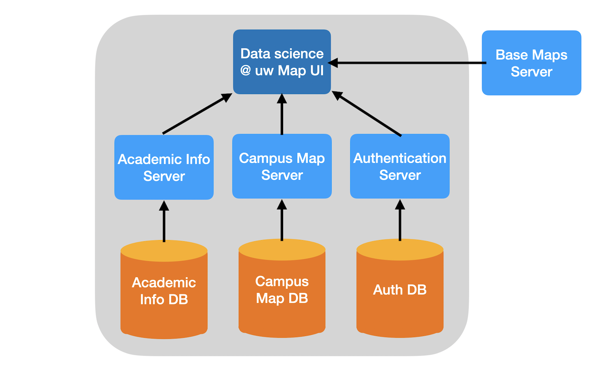

  

    
  

# datscience @ uw

Datascience @ uw is a an interactive web-based map that allows exploration of the data science community at the University of Wisconsin-Madison.  It allows for searching for people by name or by topic / area of expertise.

## Requirements

### 1. PHP 8.0+

The data science map uses Laravel9 which relies upon PHP 8.0 or later. 

### 2. Web Server

This map application requires Apache or another similar web server.

### 2. SQL Database

The data science map uses SQL for storing user, authentication, and academic information.

## Architecture

The application involves the following main components:

- Client map application

Displays the map user interface and communicates with the back end servers.

- Academic info server

Provides information about the academic community at the UW Madison.

- Authentication info server

Provides the ability to create accounts, sign in, and manage user accounts.

- Campus map server

## Installation

Instructions coming soon.

<!-- LICENSE -->
## License

Distributed under the MIT License. See `LICENSE` for more information.

<!-- TEAM -->
## Team
The datascience @ uw team includes:

Abe Megahed, Kyle Cranmer, Cris Carusi

<!-- CONTACT -->
## Contact

Abe Megahed - (mailto:amegahed@wisc.edu) - email

Project Link: [https://github.com/AFIDSI/datascience-map](https://github.com/AFIDSI/datascience-map)
